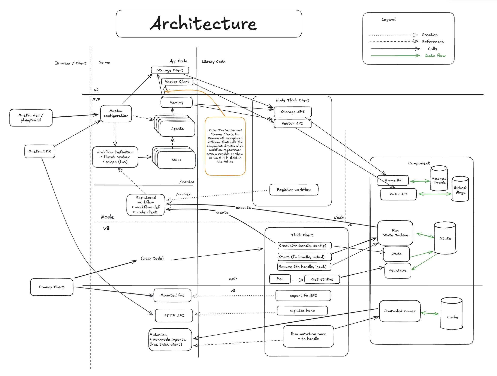

# Convex Mastra Component

[](https://badge.fury.io/js/@convex-dev%2Fmastra)

<!-- START: Include on https://convex.dev/components -->

Use [Mastra](https://mastra.ai) to build workflows, then use this component to
run them on [Convex](https://convex.dev/) as durable functions.

1. Run workflows asynchronously. Fire and forget from a serverless function (mutation or action).
2. Track the status of the workflow. Reactive queries and run-to-completion utilities.
   Or just write to the database from your steps and use normal Convex reactivity.
3. Resume a workflow from where it left off, after suspending it for user input.
4. Define retry configurations, which will use exponential backoff and jitter,
   and not use server resources in between retries.
   Each step will run in its own serverless function, providing scaling and isolation.
5. Define parallelism limits, to avoid workflows competing for resources with live requests.
6. Full support for Mastra's step forking, joining, triggering, and more.
7. Runtime validation of input, output, and trigger schemas.

```ts
export const workflowAction = registry.define(workflow);
// ...
const { start } = await runner.create( ctx, internal.file.workflowAction);
const result = await start({...});
```



### Use cases

- Agentic workflows, such as taking user input, calling multiple LLMs, calling third parties, etc.
- Durable functions including multiple steps that may fail due to third-party API failures.
- When you want to use the [Workpool](https://convex.dev/components/workpool) for multiple asynchronous steps.

Found a bug? Feature request? [File it here](https://github.com/get-convex/mastra/issues).

### Future work

- Add Convex as a Vector provider for Mastra.
- Provide Storage and Vector integrations for using Convex **from** Mastra servers.
  - Enables running from both `mastra dev` and `convex dev` for fast iterations.
  - Enables using Convex for Agent Memory.
- Support exposing the same `hono` HTTP API as Mastra servers.
- Provide helpers to export functions so browsers can call them safely.
- Add a custom mutation step, for a transactional step that will always terminate
  without needing a retry configuration (built-in for Convex).
- Support better Logging and Tracing.

## Pre-requisite: Convex

You'll need an existing Convex project to use the component.
Convex is a hosted backend platform, including a database, serverless functions,
and a ton more you can learn about [here](https://docs.convex.dev/get-started).

Run `npm create convex` or follow any of the [quickstarts](https://docs.convex.dev/home) to set one up.

## Installation

Install the component package:

```ts
npm install @convex-dev/mastra
```

**NOTE**: You also need to:

- Directly install `@libsql/client`
- Mark it as an external package
- Export it from a file in your /convex folder due to current issues.

You can do all of this by running the following commands from the project root:

```sh
npm install -D @libsql/client
echo '{"node":{"externalPackages":["@libsql/client"]}}' > convex.json
printf '"use node";\nexport * as _ from "@libsql/client";' > convex/_.ts
```

Create a `convex.config.ts` file in your app's `convex/` folder and install the component by calling `use`:

```ts
// convex/convex.config.ts
import { defineApp } from "convex/server";
import mastra from "@convex-dev/mastra/convex.config";

const app = defineApp();
app.use(mastra);

export default app;
```

## Usage

### Define a workflow from a "use node" file

```ts
"use node";
import { components } from "./_generated/api";
import { WorkflowRegistry } from "@convex-dev/mastra/registry";
import { createStep, Workflow } from "@mastra/core";

const MyStep = createStep({
  id: "MyStep",
  execute: async ({ context, suspend }) => {
    //...
  },
});

const myWorkflow = new Workflow({
  name: "myWorkflow",
})
  .step(MyStep)
  //...more steps
  .commit();

const registry = new WorkflowRegistry(components.workflow);

export const myWorkflowAction = registry.define(workflow);
```

### Create, start, and track a workflow

You can run this from any server function (mutation or action, node or otherwise)

```ts
const runner = new WorkflowRunner(components.mastra);

const { runId, startAsync, start, resume } = await runner.create(
  ctx,
  internal.myNodeFile.myWorkflowAction // the one you registered
);

const result = await start({...});
// OR
await startAsync({...});
// OR
await resume({...});

// Can call any of these from anywhere.
await runner.waitForCompletion(ctx, runId);
const status = await runner.getStatus(ctx, runId);
```

See more example usage in [example.ts](./example/convex/nodeRuntime.ts).

## Limitations

1. You can't currently register workflows dynamically. The action you register
   needs to exist at import time and the implementation needs a reference to
   the in-memory workflow you create.

### TODO before it's out of alpha

- [ ] Support variable mapping for step inputs ("variables" config for steps)
- [ ] Support conditional evaluation ("when" config for steps)
- [ ] Return the same output format as Mastra `start` / `resume`.
- [ ] Should we add `resumeAsync`? It's currently async only.
- [ ] Validate the trigger data later to surface a better error message.
- [ ] Validate the Storage and Vector implementations (from Convex).
- [ ] Detect infinite loops at runtime. They don't yet do cycle detection at
      runtime or initialization time, and for dynamic "when" it's not possible.
- [ ] Performance optimizations
  - [ ] Re-use the workflowd config document if it hasn't changed.
  - [ ] Assume the workflow config is valid and fetch configuration lazily o.w.
- [ ] Replace architecture image with something better

### TODO before it's out of beta

- [ ] Support using Storage and Vector from `mastra dev`.
- [ ] Support events - triggering and resuming with events.
- [ ] Share state between Mastra workflows and the Component.
- [ ] Configurable vacuuming of workflow state.
- [ ] Support the playground hitting Convex.
- [ ] Support running workflows in the default runtime.

### Backlog:

1. Better logging and tracing.
1. Provide a Mutation Step to avoid the v8 action and is executed exactly once.
1. Workflows currently only run in Node Actions. You can create/start/resume
   them from anywhere, but each step will be executed in the node runtime.
   This is a bit slower and more expensive than running in the default runtime.
1. Using the `ConvexStorage` from Mastra doesn't share state with workflows
   made via the Component. They're currently stored in separate tables with
   different schemas.

<!-- END: Include on https://convex.dev/components -->
